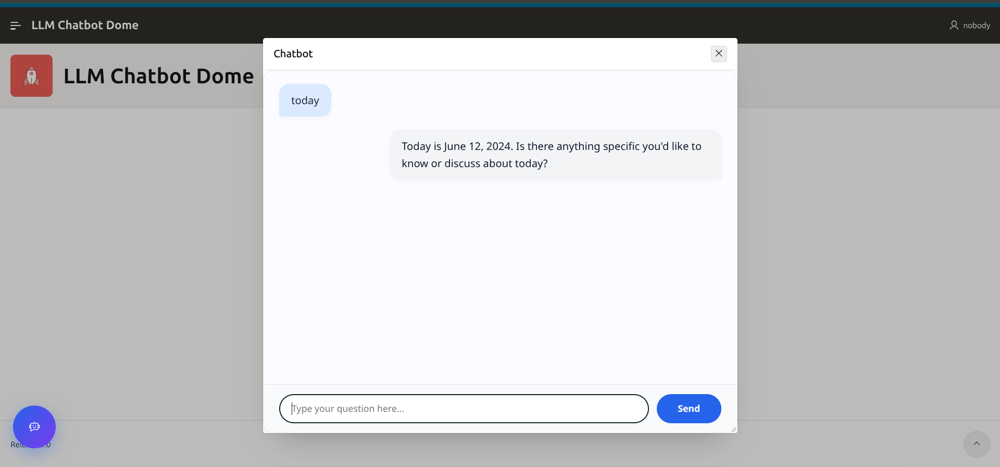
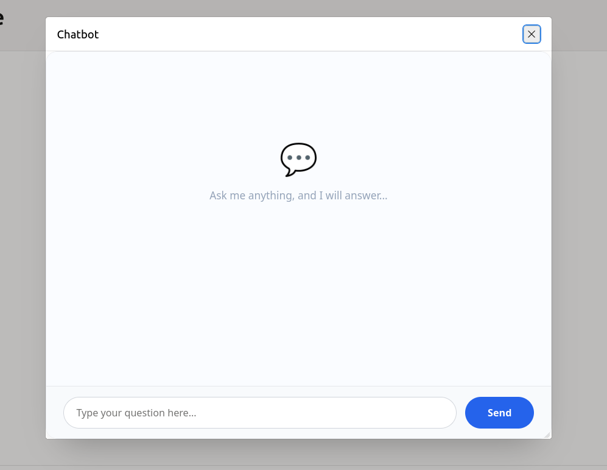
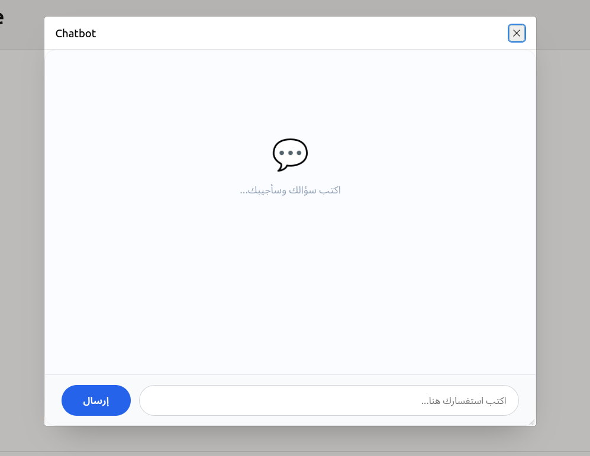
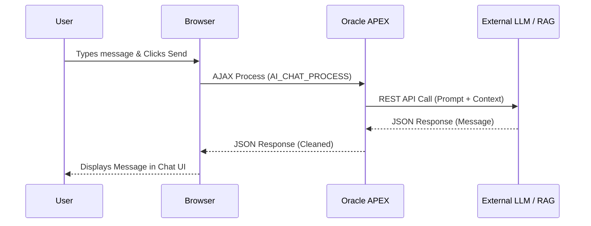

# Oracle APEX LLM Chatbot Plugin

A modern, production-ready AI Chatbot interface supporting Large Language Models (LLMs) and Retrieval-Augmented Generation (RAG) directly inside Oracle APEX.

[Overview](#overview) • [Key Features](#key-features) • [Architecture](#architecture) • [Installation](#installation) • [Documentation](#documentation) • [Live Demo](https://oracleapex.com/ords/r/app_navification/llm-chatbot-dome/home) • [Support](#support)

---

## Overview

The **Oracle APEX LLM Chatbot Plugin** provides a seamless way to integrate Artificial Intelligence into your Oracle APEX applications. Built with native APEX architecture, it delivers a modern glassmorphic UI, responsive design, and out-of-the-box support for RAG and LLM backend processes.

## Key Features

- :globe_with_meridians: **Localization**: Native support for English (LTR) and Arabic (RTL) via Plugin Attributes.
- :art: **Modern UI/UX**: Clean, responsive, glassmorphic design with animated loading states.
- :electric_plug: **Seamless Integration**: Hooks directly into APEX Application Processes.
- :book: **Markdown Support**: Gracefully strips or renders markdown formatting from AI responses.
- :lock: **Secure**: Adheres to Oracle APEX security best practices.

## Screenshots

| English UI (LTR) | Arabic UI (RTL) |
|:---:|:---:|
|  |  |

## Architecture

## Installation

Detailed instructions can be found in our [Installation Guide](docs/installation.md).

### Quick Start

1. Download the latest release from the [Releases](https://github.com/malek-al-edresi/oracle-apex-llm-chatbot-plugin/releases) page.
2. In your Oracle APEX Application, navigate to **Shared Components > Plug-ins > Import**.
3. Import the file `plugin/region_type_plugin_chatbot_llm_rag.sql`.
4. Add a new Region to your APEX page and select **LLM Chatbot** as the type.

## Configuration

To process messages, you must configure a backend PL/SQL process named `AI_CHAT_PROCESS`. See the [Configuration Guide](docs/configuration.md) for detailed setup.

### Plugin Attributes

| Attribute | Description | Default |
|-----------|-------------|---------|
| **Language Style** | Sets the UI language, direction (RTL/LTR), and localized text. | `English` |

## Documentation

Comprehensive documentation is available in the `docs/` directory:
- [Installation Guide](docs/installation.md)
- [Configuration Guide](docs/configuration.md)
- [API Integration](docs/api.md)
- [Troubleshooting](docs/troubleshooting.md)
- [FAQ](docs/faq.md)

## Compatibility Matrix

| Oracle APEX Version | Support Status |
|---------------------|----------------|
| APEX 26.x           | Supported      |
| APEX 25.x           | Supported      |
| APEX 24.1, 24.2     | Supported      |
| APEX 23.x           | Unsupported    |

*Tested on modern browsers: Chrome, Firefox, Safari, Edge.*

## Contributing

We welcome contributions! Please see our [Contributing Guidelines](CONTRIBUTING.md) and [Code of Conduct](CODE_OF_CONDUCT.md) for details on how to get started.

## Support & Acknowledgements

- **Author**: Eng. Malek M. Al-Edresi
- **License**: Apache-2.0
- **Support**: For bugs and feature requests, please [open an issue](https://github.com/malek-al-edresi/oracle-apex-llm-chatbot-plugin/issues).

---
*Created with standard Oracle DevRel open-source practices.*
