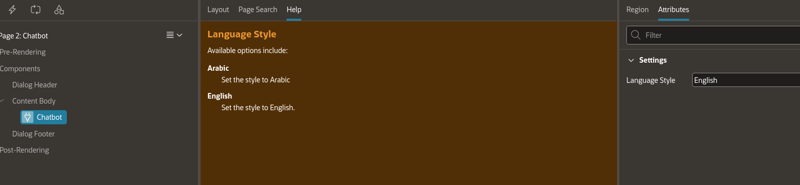
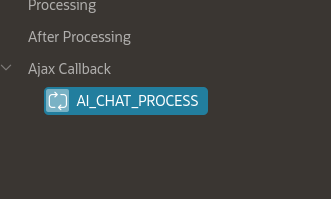
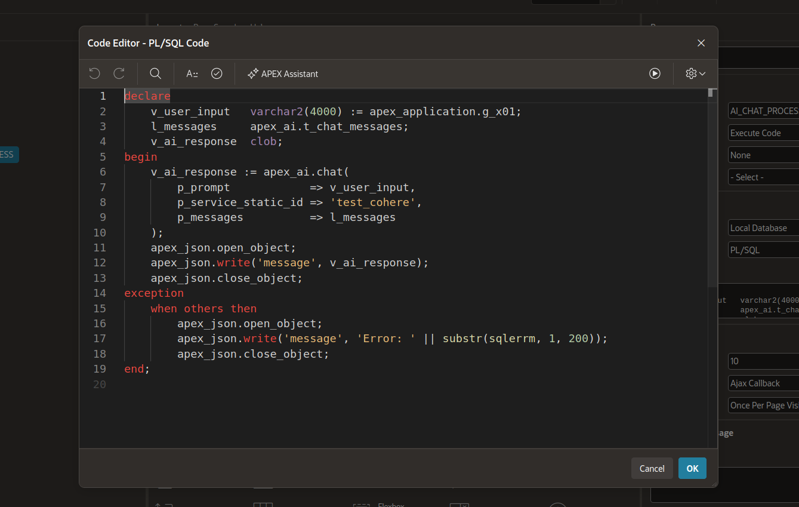

# Configuration Guide

After installing the Oracle APEX LLM Chatbot Plugin and creating the region on your page, you need to configure the backend process to handle messages.

## 1. Plugin Attributes

When you select the **LLM Chatbot** region in APEX Page Designer, you will see a specific attribute in the Property Editor:

### Language Style

| Value     | Direction | Description                                                    |
|-----------|-----------|----------------------------------------------------------------|
| `English` | LTR       | Default. All UI text (placeholder, loading indicator) in English. |
| `Arabic`  | RTL       | All UI text translated to Arabic; layout mirrors to RTL.         |



## 2. Setting Up the APEX Process

The JavaScript frontend expects an Application Process or a Page AJAX Callback named exactly **`AI_CHAT_PROCESS`**.

### Creating the Process

1. Go to **Page Designer** for the page where your chatbot resides, or go to **Shared Components > Application Processes** (if you want the chatbot available globally).
2. Create a new process.
3. Set the **Name** to `AI_CHAT_PROCESS`.
4. Set the **Point** to `Ajax Callback`.
5. Enter PL/SQL code to handle the request.



### Example PL/SQL Boilerplate

The user's message is passed via the `apex_application.g_x01` variable.

```sql
declare
    l_user_message varchar2(4000);
    l_bot_reply    varchar2(4000);
begin
    -- 1. Get the user's message
    l_user_message := apex_application.g_x01;
    
    -- 2. Validate input
    if l_user_message is null then
        apex_json.open_object;
        apex_json.write('message', 'Please provide a message.');
        apex_json.close_object;
        return;
    end if;

    -- 3. Call your LLM / RAG API
    -- (This is where you integrate with your specific backend, e.g., OpenAI, OCI Generative AI, etc.)
    -- l_bot_reply := my_llm_package.get_response(p_prompt => l_user_message);
    
    -- For demonstration, a simple echo:
    l_bot_reply := 'You said: ' || l_user_message;

    -- 4. Return the response as JSON
    apex_json.open_object;
    apex_json.write('message', l_bot_reply);
    apex_json.close_object;
    
exception
    when others then
        apex_json.open_object;
        apex_json.write('message', 'An error occurred on the server.');
        apex_json.close_object;
end;
```



### Expected JSON Response Format

The plugin expects the process to return a JSON object with a single `message` key:

```json
{
  "message": "The bot's response text goes here"
}
```

> **Important:** Do not use `htp.p()` or `dbms_output.put_line()` in your process, as it will break the JSON output parser.

## 3. JavaScript and CSS Files

The plugin automatically references the following files (stored within the plugin's file repository):
- `#PLUGIN_FILES#css/chat_styles.css`
- `#PLUGIN_FILES#js/chat_script.js`

If you need to make extensive custom modifications to the CSS or JS, you can download these files from the plugin export, modify them, and re-upload them to your workspace, or host them on your web server and adjust the plugin definition's "File URLs".

## 4. Custom Styling (Optional)

You can override the chatbot container size with page-level inline CSS:

```css
/* Full-page chatbot */
.ai-chat-container {
    height: 100vh;
    max-height: 100vh;
}

/* Fixed height chatbot */
.ai-chat-container {
    height: 600px;
}
```

## Next Steps

- [API Integration](api.md) — Detailed examples for OpenAI, OCI Generative AI, and RAG workflows.
- [Troubleshooting](troubleshooting.md) — Common issues and solutions.
- [FAQ](faq.md) — Frequently asked questions.
